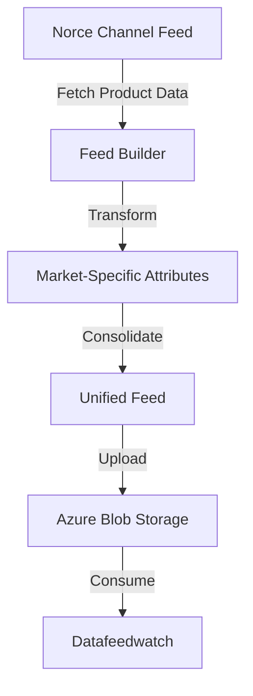

# Norce Feed Builder - Master Plan

## Overview
The Norce Feed Builder is a streamlined solution designed to consolidate product data from multiple markets into a unified feed. This system integrates with Norce's Channel Feed to fetch product information and transforms it into a format suitable for Datafeedwatch consumption, storing the results in Azure Blob Storage.

## Documentation Location
All documentation will be maintained in the [Callisto Backend Applications](https://partnersense.atlassian.net/wiki/spaces/CL/pages/877002753/Callisto+Backend+Applications) space and its subpages.

## Core Objectives
- Simple setup process for new customers
- Efficient handling of market-specific product attributes
- Cost-effective approach using single SKU with market-specific properties
- Easy maintenance and monitoring
- Maximum 3-day setup timeline for new customers
- Leverage existing codebase

## System Architecture

### Key Components
1. **Configuration Management**
   - Azure Key Vault for secure configuration storage
   - No local environment variables
   - Centralized configuration through Azure

2. **Data Storage**
   - Azure Blob Storage for feed storage

3. **Scheduled Processing**
   - Hangfire for job scheduling
   - Daily feed generation and updates

4. **Logging & Monitoring**
   - ELK Stack for logging
   - Alert configuration through ELK/Azure
   - UptimeRobot for health checks

### Data Flow

## Data Structure

### Attribute Naming Convention
- Format: `attributeName_MarketKey`
- Example: `title_SE`, `price_US`, `description_DE`
- All attributes automatically get market-specific versions

## Implementation Guidelines

### Setup Process
1. Azure Resource Configuration
   - Key Vault setup
   - Blob Storage configuration
   - App Configuration
   - ELK Stack setup

2. Application Configuration
   - Norce Channel Feed access
   - Market configurations
   - Storage settings
   - Scheduled job timing

### Error Handling
- Logging through ELK Stack
- Alerts configured in ELK/Azure
- UptimeRobot monitoring

## Documentation Requirements

### Setup Documentation
1. Prerequisites
   - Required Azure resources
   - Access permissions
   - API credentials

2. Installation Guide
   - Step-by-step setup process
   - Configuration templates
   - Validation steps

3. Troubleshooting Guide
   - Common issues and solutions
   - Error message explanations
   - Contact information for support

## Monitoring and Maintenance

### Health Checks
- UptimeRobot monitoring
- Feed generation status
- Channel Feed connectivity
- Storage availability
- ELK log monitoring
- Error rate tracking

## Development and Deployment

### Development Guidelines
- Code organization based on existing codebase
- Logging standards using ELK
- Error handling patterns
- Comprehensive unit testing focus

### Deployment Process
- GitHub workflows for CI/CD
- Stage and production environments
- Automated deployments on main branch merges

## Security Considerations
- Azure Key Vault for secrets management
- Secure API communication
- Proper access control for blob storage
- Logging security events

## Testing Strategy
- Comprehensive unit test coverage
- Feed validation tests
- Market-specific attribute testing

## Success Criteria
- Successful daily feed generation
- Proper market-specific attribute handling
- Error-free Datafeedwatch integration
- Complete documentation in Callisto Backend space
- Functional monitoring system with UptimeRobot
- Comprehensive unit test coverage